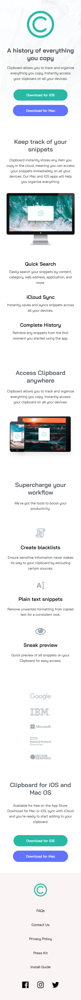

# Frontend Mentor - Clipboard landing page solution

This is a solution to the [Clipboard landing page challenge on Frontend Mentor](https://www.frontendmentor.io/challenges/clipboard-landing-page-5cc9bccd6c4c91111378ecb9). Frontend Mentor challenges help you improve your coding skills by building realistic projects. 


## Table of contents

- [Overview](#overview)
  - [The challenge](#the-challenge)
  - [Screenshot](#screenshot)
  - [Links](#links)
- [My process](#my-process)
  - [Built with](#built-with)
  - [What I learned](#what-i-learned)
- [Author](#author)

## Overview

### The challenge

### Screenshot

#### Desktop


#### Tablet


#### Mobile


### Links

- Solution URL: [My solution URL](https://github.com/jannatulmitu03/clipboard-landing-page)
- Live Site URL: [My live site URL](https://jannatulmitu03.github.io/clipboard-landing-page)

## My process

### Built with

- Semantic HTML5 markup
- CSS custom properties
- Flexbox
- Background image
- Transform (transition) 
- Mobile-first workflow


### What I learned

#### CSS

#### Transform (transition)
```css
.btn2:hover{
    background-color: hsl(233, 58%, 69%);
    transition: all .3s ease;
    }
```

## Author

- Website - [Jannatul Mitu](https://www.linkedin.com/in/jannatulmitu03)
- Frontend Mentor - [@jannatulmitu03](https://www.frontendmentor.io/profile/jannatulmitu03)
- Twitter - [@jannatulmitu03](https://twitter.com/jannatulmitu03)
